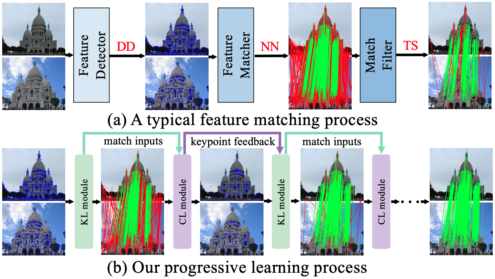

# Collaborative Feature Matching with Progressive Correspondence Learning

In this paper, we propose an end-to-end collaborative feature matching (CFM) method, which contains a keypoint learning (KL) module and a correspondence learning (CL) module, to bridge the gap between two types of works. 

<p align="center">
  
</p>

The former improves the discrimination of keypoints, and provides high-quality dynamic matches for CL module. The latter further captures the rich context of matches, and gives effective feedback to KL module. These two modules can reinforce each other in a progressive manner. Besides, we develop an efficient version of CFM, named ECFM, using an adaptive sampling strategy to avoid the negative influence of uninformative keypoints.

With this code, you can train your own CFM from scratch.

#### You should first choose your base directory. 

## Dependencies
* Python==3.9
* PyTorch == 1.12
* opencv-contrib-python == 4.5.5.64
* opencv-python == 4.5.5.64

## Data preparation

Please download the Megadepth Dataset 
(**scene_info.tar.gz**, **Undistorted_SfM.tar.gz**, **depth_undistorted.tar.gz**)
from [here](https://cvg-data.inf.ethz.ch/megadepth/).

Decompress them into {base_dir}/Megadepth

The data structure of Megadepth should be like this:

```
- {base_dir}/Megadepth
 - depth_undistorted
    - 0000
        1000564847_9a99654012_o.h5
 - scene_info
    - 0000.0.npz
 - Undistorted_SfM
    - 0000
        - images
        - sparse 
        - sparse-txt
        - stereo
        - run-colmap-geometric.sh
        - run-colmap-photometric.sh
```

Then extract local features (spp/sift), build correspondences for training:

```

python -m dump.dump_megadepth --feature_type spp

```

The data structure of generated samples for training should like this:

```
- {base_dir}/spp
    - keypoints_spp
        - 0000
            - 3409963756_f34ab1229a_o.jpg_spp.npy
    - matches_spp
        - 0000
            - 0.npy
    - matches_sep
        - 0000
            - 0.npy
    - nmatches_spp 
        - 0000_spp.npy 
    - mega_scene_nmatches_spp.npy
```

## Training

```

# CFM
python train.py --valid_layers 5 8 --iter_num 1 --base_dir {base_dir}

# ECFM
python train.py --valid_layers 5 8 --iter_num 1 --use_prune --n_min_tokens 0.8 --threshold -0.9 --layer_prune True

```

we use **2** 3090 gpus for training

## Evaluation

1. Download the pretrained weights from [here]() and put them in the <em> weights </em> directory.

2. Prepare the testing datasets (YFCC and Scannet).

	- Download YFCC dataset:
		```
		
		bash download_data.sh raw_data raw_data_yfcc.tar.gz 0 8
		tar -xvf raw_data_yfcc.tar.gz
		    
		```

  		```
  	
  		cd dump
  		python dump.py --config configs/yfcc_spp.yaml  --base_dir {base_dir}
  	
  		```
  	
  	- Download Scannet evaluation dataset from [here](https://drive.google.com/file/d/14s-Ce8Vq7XedzKon8MZSB_Mz_iC6oFPy/view)
  	
  		```
  	
  		cd dump
  		python dump.py --config configs/scannet_spp.yaml  --base_dir {base_dir}
  	
  		```
3. Prepare pretrained weights.
	Download pretrained weights from [here]().

	```

 	mkdir weights

5. Run the following the command for evaluation:
	```
	
	bash scripts/rpe/yfcc_spp_cfm.sh
	
	bash scripts/rpe/yfcc_spp_ecfm.sh
	
	```
	You should get the following results
	```
	 
	Evaluation Results of weights/CFM_spp.pth (mean over 4000 pairs):  
	AUC@5  AUC@10  	AUC@20  	
	42.96  62.55  	77.66

 	Evaluation Results of weights/ECFM_spp.pth (mean over 4000 pairs):
 	AUC@5	AUC@10	AUC@20	
 	41.94	61.71	76.99	  
 	
 	```
